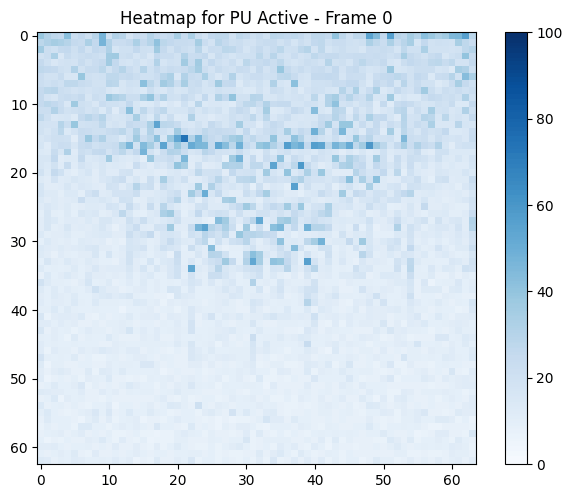
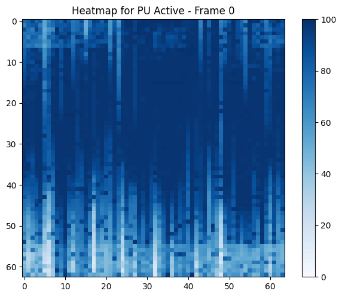
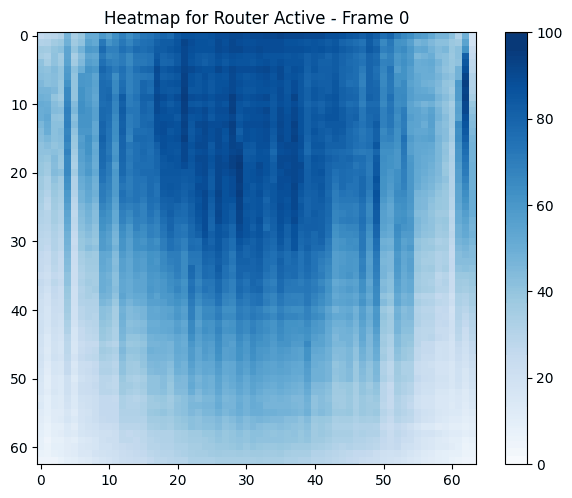
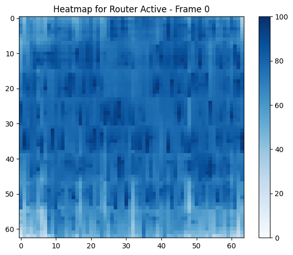

Artifact Evaluation for the paper [Tascade: Hardware Support for Atomic-free, Asynchronous and Efficient Reduction Trees](https://arxiv.org/abs/2311.15810)

# Plot Figures

## Figure 3 - Dalorex vs Tascade scaling

    python3 plots/characterization.py -p 14 -m 0
    python3 plots/characterization.py -p 14 -m 8

## Figure 4 - Cascading

    python3 plots/characterization.py -p 21 -m 0
    python3 plots/characterization.py -p 21 -m 7
    python3 plots/characterization.py -p 21 -m 8

## Figure 5 - Proxy Size

    python3 plots/characterization.py -p 12 -m 0
    python3 plots/characterization.py -p 12 -m 7
    python3 plots/characterization.py -p 12 -m 8

## Figure 6 - Proxy Cache Pressure

    python3 plots/characterization.py -p 11 -m 0
    python3 plots/characterization.py -p 11 -m 7
    python3 plots/characterization.py -p 11 -m 8

## Figure 7 - Sync Characterization

    python3 plots/characterization.py -p 24 -m 0
    python3 plots/characterization.py -p 24 -m 7

## Figure 8 - Tascade with different Networks

    python3 plots/characterization.py -p 27 -m 0
    python3 plots/characterization.py -p 27 -m 7

## Figure 9 - Heatmap

    python3 gui/gui.py -p Heatmap -n HEAT8M --nogui
    python3 gui/gui.py -p Heatmap -n HEAT8M --nogui -m 'FMCore Active'
    python3 gui/gui.py -p Heatmap -n HEAT64M --nogui
    python3 gui/gui.py -p Heatmap -n HEAT64M --nogui -m 'FMCore Active'

## Figure 10 - Scaling plots

    python3 plots/characterization.py -p 6 -m 0
    python3 plots/characterization.py -p 6 -m 2

## ANIMATION FIGURE 9

<table>
<tr>
<td>

### PU Activity (Dalorex)

</td>
<td>

### PU Activity (Tascade)

</td>
</tr>
<tr>
<td>

### Router Activity (Dalorex)

</td>
<td>

### Router Activity (Tascade)

</td>
</tr>
</table>

# Generate Runs

## Figure 5 - Proxy Size

    exp_tascade/run_exp_proxy.sh 9 0 5 128

## Figure 3 - Dalorex vs Tascade scaling (dependencies with Fig5)

    exp_tascade/run_exp_dlx_scale.sh 9 0 3

## Figure 4 - Cascading (dependencies with Fig5)

    exp_tascade/run_exp_cascading.sh 9 0  128

## Figure 6 - Proxy Cache Pressure

    exp_tascade/run_exp_pcache.sh 9 0 2 128

## Figure 7 - Sync Characterization

    exp_tascade/run_exp_sync.sh 9 0 1 128

## Figure 8 - Tascade with different Networks

    exp_tascade/run_exp_proxy_w_noc.sh 9 0 3 128

## Figure 9 - Heatmap

    exp_tascade/run_exp_heatmap.sh 2 0 1 64 Kron22

## Figure 10 - Scaling plots

    exp_tascade/run_exp_scaling_1m.sh 9 0 5

